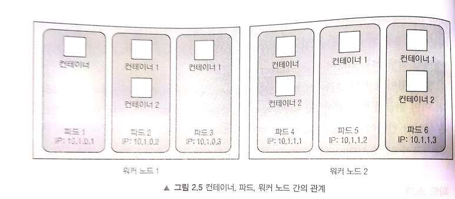

## 쿠버네티스 클러스터 설치 및 간단한 애플리케이션 실행하기(Minikube편)
source from  https://blog.naver.com/adamdoha/222245086772

MINIKUBE 대신에,  구글의 GKE를 사용하여도 된다.   EKS(Amazon Elastic Kubernetes)도 있음.
minikube는 **단일노드 클러스터**를 설치하는 **도구**이다. 로컬에서만 가능. 클라우드 미지원?

### 용어 정립
* 클러스터(Cluster)
* 노드(Node) :: 워커(worker node), ...
* 파드(Pod) :: 하나 이상의 밀접하게 연관된 **컨테이너의 그룹**.  개별적인 IP, HostName, 프로세스를 가짐( 다른 파트에서 실행 중인 컨테이너는 같은 워커 노드에서 실행 중이라 할지라도, 다른 머신에서 실행 중인 것으로 나타남.( 다른 IP )
* 컨테이너 :: 이미지를 실행한 객제?,  독립적인 쿠버네티스의 오브젝터(Object)가 아님.
* 디플로이먼트(deployment)
** create
** expose





## Installation
```
curl -LO https://storage.googleapis.com/minikube/releases/latest/minikube-latest.x86_64.rpm
rpm -ivh minikube-latest.x86_64.rpm
```
x86-64를 설치하여도 다른 Architecture가 설치되지만, Running은 된다.

```
PATH=$PATH:/usr/bin
echo $PATH
```
실행 파일에 대한 경로를 PATH에 추가한다. 

#### docker 설치
```
yum install docker
systemctl enable docker
systemctl start docker
```

#### kubectl 설치 <- 쿠버네티스 클라이언트 설치 ( Kubectl CLI 클라이언트)
```
cat <<EOF > /etc/yum.repos.d/kubernetes.repo
[kubernetes]
name=Kubernetes
baseurl=https://packages.cloud.google.com/yum/repos/kubernetes-el7-x86_64
enabled=1
gpgcheck=1
repo_gpgcheck=1
gpgkey=https://packages.cloud.google.com/yum/doc/yum-key.gpg https://packages.cloud.google.com/yum/doc/rpm-package-key.gpg
EOF
```
다운로드 받을 Repository를 설정한다.

```
yum install -y kubectl
```

#### minikube 시작 ( minikube로 쿠버네티스 클러스터 시작하기 )
```
minikube start
```
X Exiting due to DRV_AS_ROOT: The "docker" driver should not be used with root privileges.

오류가 발생하면, 맨 앞에 X 표시 및 원인에 대한 메시지를 출력한다.


```
minikube start --driver=none
```
X Exiting due to GUEST_MISSING_CONNTRACK: Sorry, Kubernetes 1.20.2 requires conntrack to be installed in root's path

```
yum install conntrack
```

```
minikube start --driver=none
```
<details><summary>결과화면</summary>
* minikube v1.18.1 on Centos 7.3.1611 (kvm/amd64)  <br>
* Using the none driver based on user configuration  <br>
* Starting control plane node minikube in cluster minikube  <br>
* Running on localhost (CPUs=4, Memory=3790MB, Disk=102388MB) ...  <br>
* OS release is CentOS Linux 7 (Core)  <br>
    > kubelet: 108.73 MiB / 108.73 MiB [-------------] 100.00% 7.17 MiB p/s 16s  <br>
  - Generating certificates and keys ...  <br>
  - Booting up control plane ...  <br>
  - Configuring RBAC rules ...  <br>
* Configuring local host environment ...  <br>
*  <br>
! The 'none' driver is designed for experts who need to integrate with an existing VM  <br>
* Most users should use the newer 'docker' driver instead, which does not require root!  <br>
* For more information, see: https://minikube.sigs.k8s.io/docs/reference/drivers/none/  <br>
*  <br>
! kubectl and minikube configuration will be stored in /root  <br>
! To use kubectl or minikube commands as your own user, you may need to relocate them. For example, to overwrite your own settings, run:  <br>
*  <br>
  - sudo mv /root/.kube /root/.minikube $HOME  <br>
  - sudo chown -R $USER $HOME/.kube $HOME/.minikube  <br>  
*  <br>
* This can also be done automatically by setting the env var CHANGE_MINIKUBE_NONE_USER=true  <br>
* Verifying Kubernetes components...  <br>
  - Using image gcr.io/k8s-minikube/storage-provisioner:v4  <br>
* Enabled addons: default-storageclass, storage-provisioner  <br>
* Done! kubectl is now configured to use "minikube" cluster and "default" namespace by default  <br>
</details>

#### 클러스터 작동 여부 확인 및 kubuctl 로 사용해 보기
```
kubectl  cluster-info
```
<details><summary> 결과화면 </summary>
Kubernetes control plane is running at https://10.0.0.2:8443
KubeDNS is running at https://10.0.0.2:8443/api/v1/namespaces/kube-system/services/kube-dns:dns/proxy
</details>

#### 클러스터 노드를 조회해, 클러스터 동작 상태 확인하기
```
kubectl get nodes
```
<details><summary> 결과화면 </summary>
NAME        STATUS   ROLES                  AGE   VERSION
localhost   Ready    control-plane,master   13h   v1.20.2
</details>

#### 파드 조회하기
```
kubectl get pods
```
<details><summary> 결과화면 </summary>
| NAME    |                     READY |  STATUS  |  RESTARTS   |AGE |   <br>
| ------  |  ----------               |  -------  | ---------   | --- |   <br>
|test      |                      1/1  |  Running  |  0          | 13h |   <br>
|test-node-5c769c86cc-w9jt5 |  1/1   |  Running |   0   |        13h    |   <br>
</details>


#### shiny new cluster
```
kubectl get po -A
```
<details><summary> 결과화면 </summary>
NAMESPACE     NAME                                READY   STATUS    RESTARTS   AGE             <br>
kube-system   coredns-74ff55c5b-xst4m             1/1     Running   0          8m20s           <br>  
kube-system   etcd-localhost                      1/1     Running   0          8m30s           <br>
kube-system   kube-apiserver-localhost            1/1     Running   0          8m30s           <br>
kube-system   kube-controller-manager-localhost   1/1     Running   0          8m30s           <br>
kube-system   kube-proxy-fwmtn                    1/1     Running   0          8m20s           <br>
kube-system   kube-scheduler-localhost            1/1     Running   0          8m30s           <br>
kube-system   storage-provisioner                 1/1     Running   0          8m36s           <br>
</details>


```
minikube dashboard
```
<details><summary> 결과화면 </summary>
http://211.236.230.232:38012/api/v1/namespaces/kubernetes-dashboard/services/http:kubernetes-dashboard:/proxy/#1/pod?namespace=kube-system    
</details>

#### Deploy Applications
```
kubectl create deployment hello-minikube --image=k8s.gcr.io/echoserver:1.4
kubectl expose deployment hello-minikube --type=NodePort --port=8080
minikube service hello-minikube
```
<details><summary> 결과화면 </summary>
|-----------|----------------|-------------|-----------------------|  <br>
| NAMESPACE |      NAME      | TARGET PORT |          URL          |  <br>
|-----------|----------------|-------------|-----------------------|  <br>
| default   | hello-minikube |        8080 | http://10.0.0.2:30768 |  <br>
|-----------|----------------|-------------|-----------------------|  <br>
* Opening service default/hello-minikube in default browser...        <br>
  - http://10.0.0.2:30768                                             <br>
 ==> CloudIT에서는  외부 IP 즉 http://211.236.230.232:30768            <br>
</details>

#### Application 실행하기
```
kubectl run test --image=adamdoha/test --port=8080 --generator=run/v1
kubectl get pods
kubectl describe pods
```
image가 로컬에 없으면, 또는 docker허브로 지정되어 있으면  docker허브로부터 다운받아서, pod 및 컨테이너를 형성한다.


### Deployment 만들기
```
kubectl create deployment test-node --image=adamdoha/test
kubectl get deployments
kubectl describe pods
kubectl expose deployment test-node --type=LoadBalancer --port=8080
kubectl get services
minikube service test-node
curl http://211.236.230.232:30768/
```
test-node라는  deployment가 형성된다. 물론 새로운 pod도 형성된다.


#### 각종 조회
```
kubectl cluster-info                   # 클러스터가 정상동작하고 있는지
kubectl get nodes
kubectl get pods
kubectl get svc
```

#### Delete a local cluster
```
minikube stop
minikube delete
```


## Uninstall
```
minikube stop; minikube delete
docker stop (docker ps -aq)
rm -r ~/.kube ~/.minikube
sudo rm /usr/local/bin/localkube /usr/local/bin/minikube
systemctl stop '*kubelet*.mount'
sudo rm -rf /etc/kubernetes/
docker system prune -af --volumes
```

